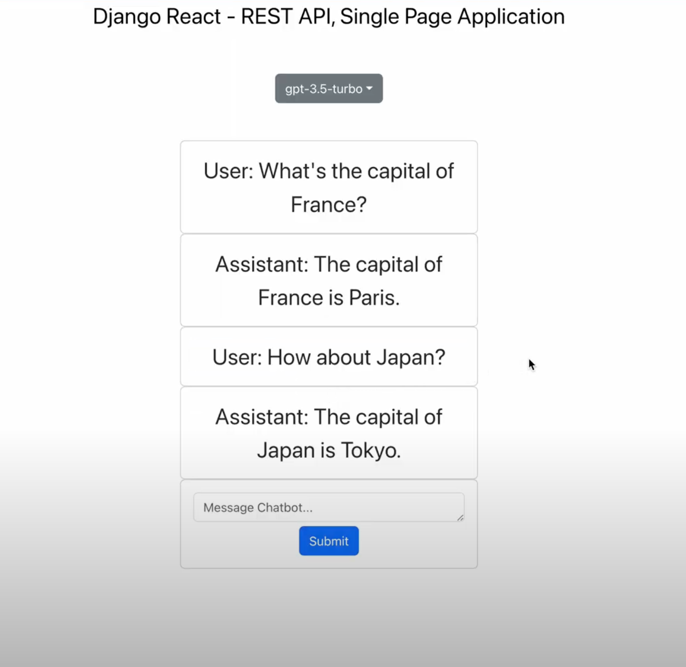

# django-react-chatbot

## Video Demonstration

[Watch the video](https://drive.google.com/file/d/1xppHfOcZCOiW7K0ZCd771ap9fkkC3fh9/view)


## Getting Started
Before running the application, make sure to install the necessary dependencies. Follow these steps:

1. Open a terminal or command prompt.
2. Navigate to the project directory.

3. Install the backend dependencies using pip:
   ```
   pip install -r requirements.txt
   ```
   This command will install all the Python packages listed in the `requirements.txt` file.

4. Navigate to the frontend directory:
   ```
   cd frontend
   ```

5. Install the frontend dependencies using npm:
   ```
   npm install
   ```
   This command will install all the JavaScript packages required by the frontend.

Once the dependencies are installed, you can run the application:

6. Navigate back to the project root directory:
   ```
   cd ..
   ```

7. Run the following command to start the application:
   ```
   npm run start
   ```

This command will execute `python manage.py run server` to start the backend server and `npm start` to start the frontend development server concurrently.